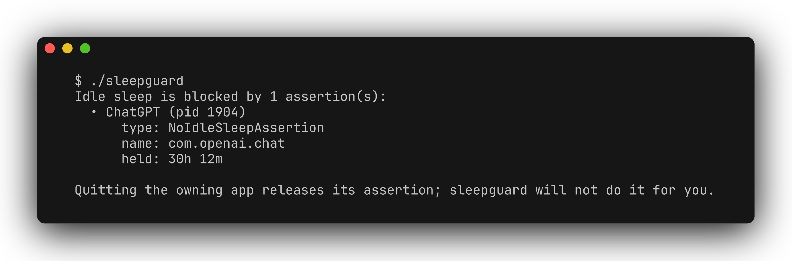

# sleepguard

[](README.md) [](README.zh-CN.md)

A read-only macOS sleep-blocker inspector with a CLI and menu-bar app. It reads IOKit power assertions, names process owners and documented kernel idle-sleep blockers, reports held duration where available, and checks the standing `SleepDisabled` setting.

**Development prototype—not a signed or notarized release.** Build from source; the menu-bar bundle is ad-hoc signed for local use only.



[Demo video](docs/demo.mp4)

## Build and run

Requires macOS 13+ and a Swift 6.1+ toolchain with the macOS SDK.

```bash
git clone https://github.com/zhuhroscar-tech/sleepguard.git
cd sleepguard
swift build -c release
./.build/release/sleepguard
```

For the menu-bar preview, which shares the same `SleepGuardCore` and offers Rescan:

```bash
bash scripts/build_app.sh
open dist/SleepGuard.app
```

The app has no Developer ID signature or notarization. Gatekeeper may block a copied bundle on another Mac; do not treat it as a distributable release.

## Reading results

| Exit | Meaning |
| --- | --- |
| `1` | IOKit read failed |
| `3` | A blocker is confirmed, even if other checks are incomplete |
| `2` | Scan incomplete or verdict unknown |
| `0` | No blocker within the tool's covered scope, with required checks complete |

Unknown assertion types, inconsistent driver data and failed setting reads are not silently treated as harmless. Read warnings before interpreting the verdict: snapshots can become stale immediately.

## Safety and scope

Never kills or signals processes, creates/modifies assertions, changes power settings, requests administrator privileges or installs helpers. No network requests, telemetry or user-document reads.

Coverage is deliberately limited: `IODisplayWrangler`-style power-plane “Idle sleep preventers”, scheduled dark wakes and Power Nap are not covered. Aggregate levels cannot reveal every unreadable holder when a readable holder of the same type exists. A clean report **does not prove nothing can keep the Mac awake**; compare with `pmset -g assertions`.

`SleepDisabled` is an undocumented property read through a public API; kernel level interpretation also includes measured assumptions. See the compact [classification and API reference](docs/REFERENCE.md) for these limits and their basis.

## Tests

```bash
swift run sleepguard-tests
RUN_LIVE_TESTS=1 swift run sleepguard-tests
```

The first command runs deterministic tests. The second opts into live IOKit checks; restricted hosts may skip checks, and live totals vary with system state.

[MIT license](LICENSE)
